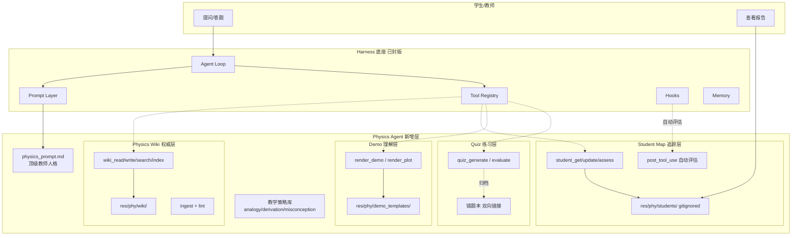
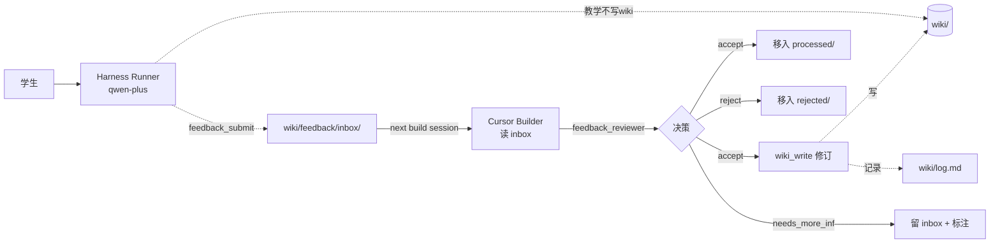

# 物理教学 Agent (Physics Tutor) 实现计划

> **目标**：在 Harness 通用 Agent 框架之上，构建一个覆盖高中物理主干、进阶提供竞赛辅导的**顶级物理教师**风格交互式 Agent
> **分支**：`vertical-industry`
> **依赖**：Harness 主线 `step-11` 封版作为底座（提示词/工具/流式/会话/记忆/Hooks 机制复用）
> **参考**：`res/phy/LLM Wiki.pdf`（LLM Wiki 三层架构）

---

## 架构血统：Builder / Runner 二分

物理子项目存在两个智能体角色，**血统不可混淆**，对应工程上典型的 build-time / runtime 分离：

| 角色 | 模型 | 类比 | 场景 | wiki 权限 |
|------|------|------|------|-----------|
| **Builder** | Cursor Agent（Claude） | 教研组 / 编辑 | 开发对话、知识库扩充 | 读写 |
| **Runner** | Harness Agent（qwen-plus） | 课堂老师 | 学生使用 CLI / 仪表盘 | **只读 + 写 feedback** |

设计意图：
- Wiki 是"作品"，由 Cursor + 工具脚本构建（一次性高质量投入）
- Harness 只读这个作品（高频低成本响应）
- Runner 通过 **Feedback Loop** 把"看到的问题"传给 Builder，Cursor 审核后修订（详见后文）

## 设计哲学

三个核心支柱 + 一个治理机制：

| 层 | 角色 | 类比 |
|----|------|------|
| **Physics Wiki** | 稳定、可追溯、LLM 自维护的物理知识图谱（**含图片资产**） | 教研组共享备课库 |
| **Student Map** | 每个学生个人的任督二脉图谱 | 学生档案与错题本 |
| **Interactive Demo** | 基于物理引擎的 HTML5 交互演示 | 实验器材 / 模拟实验室 |
| **Reviewer Persona** | 配置化的虚拟物理教师，自动评审流水线关键节点 | 教研组长 / 命题组长 |

三个支柱**节点 id 对齐**：Wiki 的 `mechanics/newton-second-law` 就是 Student Map 上同名节点的锚点，也是 Quiz/Demo 归类的主键。这种同构关系让 Agent 能够：

- 讲解时依 Wiki 保证正确性（防 LLM 幻觉漂移）
- 评估时依 Student Map 定位薄弱（因材施教）
- 演示时依 Demo 模板即时生成可交互场景（降低抽象门槛）

**Reviewer Persona** 让流水线在不卡真人的前提下保留专业性把关，详见 `.cursor/rules/physics-project.mdc` 的 Reviewer 段落。

---

## 整体架构



---

## 技术选型

| 维度 | 选择 | 理由 |
|------|------|------|
| 知识存储 | **Markdown + frontmatter**，双向链接 | 对齐 LLM Wiki，LLM 易读写、人类可审 |
| 学生图谱 | **JSON**（节点 id 与 wiki 对齐） | 结构化便于评估、可导出 |
| 物理引擎 | **matter.js**（2D 刚体）+ **p5.js**（自由绘制） | 高中/竞赛 2D 场景充分，生态成熟 |
| 函数/场可视化 | **Plotly.js** | 声明式、iframe 嵌入简单 |
| 3D / 动画影片 | ❌ 不纳入 V1-V7 | Manim 渲染重，与即时交互诉求不符 |
| 仪表盘 | **Streamlit**（复用 Harness 方案） | 零前端负担，iframe 嵌入 HTML5 demo |
| 学生图谱渲染 | **pyvis** | 交互式网络图，零前端代码 |
| **Ingest 解析** | **MinerU**（vlm 模型为主） | 物理教材公式/表格/示意图密集，MinerU vlm 业界最佳；保留图片资产 |
| Reviewer LLM | 复用 Harness `src.client`（qwen-plus, low temperature) | 不引入新依赖 |

**明确排除**：Manim（渲染不即时）、Three.js（3D 场景高中用不到）、私有题库 API（脱离教学框架定位）、pypdf 直抽文本（无法处理图片公式，被 MinerU 替代）。

---

## 目录结构

```
harness/ (vertical-industry 分支)
├── PHY_PLAN.md                    # 本文件
├── PHY_PROGRESS.md                # 物理子项目进度日志
├── .cursor/rules/
│   ├── physics-project.mdc        # 物理专属规则（含 Reviewer / Ingest 工作流）
│   ├── mineru-tool.mdc            # MinerU 工具使用规范（V1 建立）
│   └── task-protocol.mdc          # 已扩展，说明 PHY 文档分治
├── res/phy/
│   ├── LLM Wiki.pdf               # 参考方案
│   ├── wiki/                      # LLM 维护的权威知识图谱
│   │   ├── index.md               # 双索引（按学科 + 按教材章节），wiki_index 维护
│   │   ├── log.md                 # 8 步 ingest 状态机日志（断点恢复）
│   │   ├── overview.md            # 知识库覆盖度与待补区域概览
│   │   ├── sources/               # 每次 ingest 的章节摘要页（桥接 raw 与 wiki）
│   │   │   └── pep-v1-ch3.md      # 例：人教版必修一第三章摘要
│   │   ├── feedback/              # Runner→Builder 反馈队列（V3 引入）
│   │   │   ├── inbox/             # 待处理（runner append-only）
│   │   │   ├── processed/         # 已接受并修订
│   │   │   └── rejected/          # 拒绝（带理由）
│   │   ├── mechanics/*.md         # 学科分类的概念/原理/题型页
│   │   ├── electromagnetism/*.md
│   │   ├── thermodynamics/*.md
│   │   ├── optics/*.md
│   │   └── modern/*.md
│   ├── raw/                       # 原始资料（只读），溯源锚点
│   │   └── pep/v1/                # 例：人教版必修一
│   │       ├── full.pdf           # 原 PDF（不可改）
│   │       ├── ch3.md             # MinerU 转出的 markdown
│   │       └── ch3-images/        # MinerU 提取的图片（电路/受力/波形等）
│   │           ├── img-001.png
│   │           └── ...
│   ├── schemas/
│   │   └── PHYSICS_SCHEMA.md      # Wiki 写作约定（V1 建立，含图片/公式字段）
│   ├── demo_templates/            # 6 个 HTML5 核心模板（V5 填充）
│   │   ├── projectile.html
│   │   ├── pendulum.html
│   │   ├── spring.html
│   │   ├── circuit.html
│   │   ├── wave.html
│   │   └── orbit.html
│   ├── renders/                   # render_demo 生成的实例 HTML（gitignore）
│   └── students/                  # 学生档案 ⚠️ gitignore 排除
│       └── <student_id>.json
├── src/phy/
│   ├── __init__.py
│   ├── wiki.py                    # V1 Wiki CRUD（4 工具）
│   ├── ingest.py                  # V2 8 步 ingest 工作流编排（builder 工具）
│   ├── feedback.py                # V3 feedback_submit (runner) + resolve/reject (builder)
│   ├── strategies.py              # V3 教学策略工具（runner）
│   ├── physics_prompt.md          # V3 顶级教师人格提示词
│   ├── student.py                 # V4 Student Map（runner）
│   ├── render.py                  # V5 Demo/Plot 渲染（runner）
│   ├── quiz.py                    # V6 练习题系统（runner）
│   ├── tools/
│   │   └── mineru.py              # V1 MinerU 解析工具（builder, CLI）
│   └── reviewers/                 # 配置化的虚拟教师角色
│       ├── physics_teacher_reviewer.md   # V2（cursor）拆分粒度评审
│       ├── feedback_reviewer.md          # V3（cursor）反馈审核
│       ├── assessment_reviewer.md        # V4（harness）学生评估
│       ├── quiz_quality_reviewer.md      # V6（harness）题目审核
│       └── report_reviewer.md            # V7（harness）报告把关
└── dashboard/pages/
    ├── phy_1_wiki.py              # Wiki 浏览 + log 状态可视化
    ├── phy_2_student_map.py       # 学生图谱 (pyvis)
    ├── phy_3_tutor.py             # 交互教学台 (iframe demo)
    └── phy_4_report.py            # 学习报告
```

---

## 分步规划 V1 ~ V7

每个 `VN` 为一次封版，对应 git tag `phy-vN`，可独立演示。内部子任务编号 `VN.M`，详细清单在 `PHY_PROGRESS.md`。

### V1 — Wiki 基础设施 + MinerU 解析底座

**目标**：搭起 Wiki 最小闭环，LLM 能读写自己的知识库；同时建立教材解析能力，为 V2 ingest 流水线备好"读"的工具。

- 产出（schema 与日志层）：
  - `res/phy/schemas/PHYSICS_SCHEMA.md`（frontmatter 含 `images` / `formulas` 字段，双向链接，log 格式）
  - `res/phy/wiki/index.md`（双索引模板：按学科 + 按教材）
  - `res/phy/wiki/log.md`（8 步 ingest 状态机骨架）
  - `res/phy/wiki/overview.md`（覆盖度概览模板）
- 产出（解析工具）：
  - `src/phy/tools/mineru.py`（移植参考方案 + 物理特化：默认 vlm，强制 page-ranges，自动迁移图片到 `<source-stem>-images/`，自动重写 markdown 图片路径）
  - `.cursor/rules/mineru-tool.mdc`（API/模型选择、错误码、产物归位规范）
- 产出（Wiki CRUD 工具）：
  - `src/phy/wiki.py`：`wiki_read` / `wiki_write` / `wiki_search` / `wiki_index`
  - 注册到工具表，受 hooks/security 层保护
- 产出（仪表盘）：
  - `dashboard/pages/phy_1_wiki.py`：页面浏览 + 反向链接 + log 状态机可视化（哪些 ingest 在 active/paused/done）
- **冒烟验证**：手工跑 `python src/phy/tools/mineru.py file <小 PDF> --output res/phy/raw/test/`，确认 markdown + images 正确落盘；调用 `wiki_write` 新建一个测试页并出现在 `index.md`
- 验收：MinerU 能解析图文公式 PDF，wiki 四工具闭环可用

### V2 — Ingest 8 步流水线 + Reviewer + Lint + 端到端实跑

**目标**：把"读教材 → 写 wiki"做成可断点恢复的状态机，引入 Reviewer Persona 替代真人评审，并完成首章端到端验证。

- 产出（Reviewer Persona 引入）：
  - `src/phy/reviewers/physics_teacher_reviewer.md`（资深物理教研组长人格 + ingest.split_review 输入输出契约）
  - `src/phy/reviewers/__init__.py` 提供 `call_reviewer(persona_id, payload) -> dict` 通用调用入口（独立 LLM session、写 audit log）
- 产出（Ingest 编排）：
  - `src/phy/ingest.py`：`ingest_chapter(source, page_ranges)` 工具，按 8 步状态机推进
  - 每步操作通过 hooks 写入 `wiki/log.md`，`state` 在 `active / paused / done` 间正确流转
  - 步骤 4 调用 `physics_teacher_reviewer`，结果写入 `user_guidance` 字段
  - 启动协议：每次工具调用前先扫描 log.md，发现未完成任务时优先恢复
- 产出（Lint）：
  - `src/phy/wiki.py` 增加 `wiki_lint`：孤儿页 / 缺图 / 公式冲突 / frontmatter 缺字段 / 链接断裂
- 产出（教材骨架）：
  - `res/phy/raw/pep/v1/`、`res/phy/raw/pep/v2/`（按用户提供的实际教材建立）
- **端到端验收**（必须实跑，不靠模拟）：
  - 选择一章用真实 MinerU + Reviewer 跑通 8 步全流程
  - 产出至少 1 个 sources 摘要 + 5 个学科概念页 + 图片正确引用
  - 中途模拟一次"对话中断"，重启后能从 log 断点恢复完成剩余步骤
  - `wiki_lint` 全绿
- 依赖：V1

### V3 — 教师 Persona + 教学策略 + Feedback Loop 接入

**目标**：让 Agent 穿上"顶级物理老师"的皮，具备可调用的教学策略；同时建立 Runner → Builder 的反馈通道。

- 产出（教师与策略）：
  - `src/phy/physics_prompt.md`（人格 + 教学原则 + wiki 使用守则）
  - 三个策略工具：`teach_analogy` / `teach_derivation` / `teach_misconception`
  - `src/prompt.py` 扩展 `--mode physics` 分支（不污染主线）
- 产出（Feedback Loop 最小可用版）：
  - `src/phy/feedback.py`：runner 端 `feedback_submit` 工具 + builder 端 `feedback_resolve` / `feedback_reject` 工具
  - `src/phy/reviewers/feedback_reviewer.md`（Cursor 充当，输出 accept/reject/needs_more_info）
  - `res/phy/wiki/feedback/{inbox,processed,rejected}/` 目录骨架 + README
  - `src.security` policy 加 file rule：runner 只能 `O_CREAT | O_EXCL` 写 inbox/，无法改 processed/rejected
  - 教学结束 hook（post-session）自动扫一遍对话，判断是否值得 submit
  - Cursor build session 启动协议：扫 inbox 报告未处理数量
- 验收：
  - CLI `harness --mode physics` 启动后，问答默认走苏格拉底式引导
  - 学生说"这里讲错了" → runner 调用 feedback_submit → inbox/ 出现新 ticket
  - 模拟一个 ticket，Cursor 用 feedback_reviewer 评估并执行 accept 流程，wiki 修订成功
- 依赖：V1、V2

### V4 — 学生知识图谱

**目标**：每次互动都能自动更新学生的任督二脉图谱。

- 产出：`StudentMap` 数据结构（节点 id 与 wiki 对齐，含掌握度 0-1、最近活动、错因标签）
- 产出：工具 `student_get` / `student_update` / `student_assess`
- 产出：`post_tool_use` hook 自动从对话评估并更新掌握度
- 产出：`phy_2_student_map.py`（pyvis 交互图）
- 验收：一次问答后 Student Map 对应节点掌握度变化可见
- 依赖：V1、V3、Harness Hooks 层

### V5 — HTML5 交互演示

**目标**：vibe coding 的即时产物，演示能嵌入对话。

- 产出：6 个核心模板（斜抛 / 单摆 / 弹簧振子 / 简单电路 / 机械波 / 天体运动）
- 产出：`render_demo(template, params)`（模板 + 参数 → 生成 HTML 片段到 `res/phy/renders/`）
- 产出：`render_plot(expr, range)`（Plotly 函数/场可视化）
- 产出：`phy_3_tutor.py` 仪表盘，iframe 嵌入生成的 demo
- 验收：讲"斜抛"时 Agent 能生成可拖动初速度向量的 demo
- 依赖：V1、V3

### V6 — 自适应练习题 + 数据信号触发反馈

**目标**：依 wiki 保正确、依 Student Map 定难度，错题自动归档；同时让 quiz 数据成为 Feedback Loop 的第三种触发源。

- 产出：`quiz_generate`（基于 wiki + 学生弱点定向，生成题目 + 标准解答）
- 产出：`quiz_evaluate`（判分 + 错因分析 + 更新 StudentMap）
- 产出：错题本（双向链接到 wiki 和 student 节点）
- 产出：IRT-lite 难度调节（三参数简化版，按正确率动态选题）
- 产出（Feedback 自动信号）：
  - `post_tool_use` hook 监测 quiz_evaluate 信号：同 wiki 节点 N 名学生连错率 > 阈值 → 自动调用 `feedback_submit(kind=unclear|error)`
  - IRT 难度估计偏离 wiki `level` 字段时也自动 submit
  - 自动提交去重：同 target + 24 小时内 + 同 kind 不重复
- 验收：学生连错两题后，下一题自动降难度并聚焦前置知识；模拟 5 名学生在同节点连错，inbox 出现去重后的 1 条 feedback
- 依赖：V1、V4、V3 的 Feedback Loop

### V7 — 学习报告与仪表盘收束

**目标**：教师和学生两个视角的成品体验。

- 产出：`phy_4_report.py`（周/月掌握度变化、错题 top N、复习推荐）
- 产出：学生/教师视图切换（教师多看班级汇总、学生多看自我进度）
- 产出：一键导出学习档案（JSON + Markdown 报告）
- 验收：连续使用一周后能看到清晰的知识掌握度曲线
- 依赖：V1-V6 全部

---

## Reviewer Persona 演进路线（横切 V2-V7）

| Reviewer | 引入版本 | executor | 评审场景 | 输出契约要点 |
|----------|----------|----------|----------|--------------|
| `physics_teacher_reviewer` | V2 | **cursor** | ingest 步骤 4 拆分粒度 | 给出 splits 列表 + user_guidance + confidence |
| `feedback_reviewer` | V3 | **cursor** | Feedback Loop 反馈审核 | accept / reject / needs_more_info + reasoning |
| `assessment_reviewer` | V4 | harness | 学生掌握度评估校对 | 修正 mastery 估值 + 标注异常 + reasons |
| `quiz_quality_reviewer` | V6 | harness | 题目难度/科学性/教学价值 | 接受 / 重写 / 拒绝 + 修改建议 |
| `report_reviewer` | V7 | harness | 学习报告语气与内容把关 | 内容裁剪建议 + 鼓励性语句润色 |

**executor 区分原则**：
- Build-time 触发（Cursor 在场）→ `executor: cursor`：质量最高、零额外成本、用户可即时质疑
- Runtime 触发（学生在场，Cursor 不在）→ `executor: harness`：保持 runtime 闭环

所有 Reviewer 都遵循 `.cursor/rules/physics-project.mdc` 的统一调用约定，便于真人通过仪表盘审计与覆写。

## Wiki Feedback Loop（Runner → Builder）

Harness Runner 没有 wiki 写权限，但能把"看到的问题"通过 append-only 反馈队列传给 Builder。Cursor 在 build-time 审核后修订。



**关键约束**：
- 队列目录 `res/phy/wiki/feedback/inbox/` 对 runner 仅开放 `O_CREAT | O_EXCL`（通过 `src.security` policy 实现）
- `processed/` / `rejected/` 仅 builder 可写
- 三种触发源：学生显式反馈（V3）、教学结束自审（V3 hook）、数据信号（V6 quiz 错误率/IRT 异常）
- 详细 ticket 格式与处理协议见 `.cursor/rules/physics-project.mdc` 的 Feedback Loop 段落

## 风险点与缓解

| 风险 | 影响 | 缓解 |
|------|------|------|
| Wiki 初始填充工作量大 | 拖慢 V2 后所有阶段 | 先用小范围（力学两章）走 ingest 全流程，再横向扩展 |
| MinerU 配额 / 大文件超限 | V2 实跑卡壳 | 强制 `--page-ranges`，配额吃紧时切轻量 API；失败按规则回退 |
| 图片资产丢失 / 路径错位 | wiki 引用断裂、教学不可用 | `tools/mineru.py` 自动迁移 + markdown 路径重写 + lint 检查缺图 |
| Reviewer Persona 决策偏差 | 拆分粒度不合理、评估失准 | 输出带 confidence；< 0.6 标记待复核；真人可仪表盘覆写 |
| 自动评估（V4）准确性 | Student Map 失真、错题本失效 | LLM 打分 + reviewer 复议 + 学生复议三重机制 |
| HTML5 demo 安全性 | 渲染注入风险 | `render_demo` 仅填充模板参数，不执行任意 JS；iframe sandbox 属性 |
| 竞赛深度覆盖 | 与高中基础冲突 | `level: competition` 字段分层，默认走 basic |
| 知识漂移 | LLM 在 wiki 之外乱答 | `wiki_search` 前置必要时作为硬规则；错误处理流程强制回写 log |

---

## 与 Harness 主线的协作

- **复用**：Agent Loop / 流式 / 工具注册 / Hooks / Memory / Session / Permissions
- **扩展点**：
  - 新增 `src/phy/` 作为独立模块
  - `src/prompt.py` 加 `--mode` 分支（V3 时最小改动）
  - `tools` 注册支持按 mode 动态加载（物理工具只在 physics mode 下出现）
- **不动**：`PLAN.md` / `PROGRESS.md` / Harness 主线所有已封版代码
- **封版节奏**：每个 `VN` 完成后，commit → `git tag phy-vN` → 更新 `PHY_PROGRESS.md`

---

## 验收与教学价值

完成 V1-V7 后，本仓库将示范：

1. 如何在一个通用 Agent 框架之上叠垂直行业能力（规则 / 工具 / 人格 / 数据分离）
2. 如何用 LLM Wiki 模式解决"大模型知识不稳定"问题
3. 如何通过同构图谱实现"权威知识"和"学生画像"的双向追踪
4. 如何用 vibe coding + 模板库把抽象物理变成可交互体验

本计划在 `vertical-industry` 分支长期固化，实时进度见 `PHY_PROGRESS.md`。
