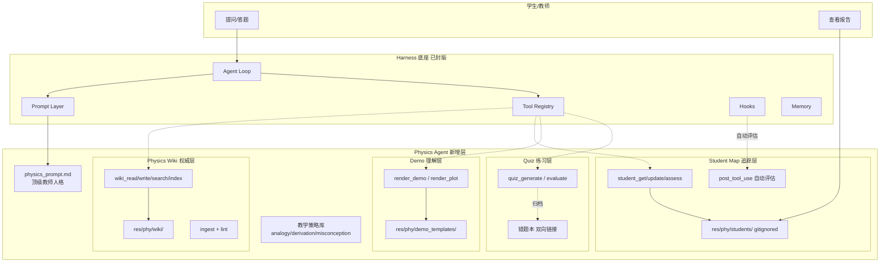

# 物理教学 Agent (Physics Tutor) 实现计划

> **目标**：在 Harness 通用 Agent 框架之上，构建一个覆盖高中物理主干、进阶提供竞赛辅导的**顶级物理教师**风格交互式 Agent
> **分支**：`vertical-industry`
> **依赖**：Harness 主线 `step-11` 封版作为底座（提示词/工具/流式/会话/记忆/Hooks 机制复用）
> **参考**：`res/phy/LLM Wiki.pdf`（LLM Wiki 三层架构）

---

## 设计哲学

三个核心支柱，对应学生学习三要素（**知识** × **跟踪** × **理解**）：

| 支柱 | 目标 | 类比 |
|------|------|------|
| **Physics Wiki** | 稳定、可追溯、LLM 自维护的物理知识图谱 | 教师的"教研组共享备课库" |
| **Student Map** | 每个学生个人的任督二脉图谱 | 教师的"学生档案与错题本" |
| **Interactive Demo** | 基于物理引擎的 HTML5 交互演示 | 实验器材 + 模拟实验室 |

三者**节点 id 对齐**：Wiki 的 `mechanics/newton-second-law` 就是 Student Map 上同名节点的锚点，也是 Quiz/Demo 归类的主键。这种同构关系让 Agent 能够：

- 讲解时依 Wiki 保证正确性（防 LLM 幻觉漂移）
- 评估时依 Student Map 定位薄弱（因材施教）
- 演示时依 Demo 模板即时生成可交互场景（降低抽象门槛）

---

## 整体架构



---

## 技术选型

| 维度 | 选择 | 理由 |
|------|------|------|
| 知识存储 | **Markdown + frontmatter**，双向链接 | 对齐 LLM Wiki，LLM 易读写、人类可审 |
| 学生图谱 | **JSON**（节点 id 与 wiki 对齐） | 结构化便于评估、可导出 |
| 物理引擎 | **matter.js**（2D 刚体）+ **p5.js**（自由绘制） | 高中/竞赛 2D 场景充分，生态成熟 |
| 函数/场可视化 | **Plotly.js** | 声明式、iframe 嵌入简单 |
| 3D / 动画影片 | ❌ 不纳入 V1-V7 | Manim 渲染重，与即时交互诉求不符 |
| 仪表盘 | **Streamlit**（复用 Harness 方案） | 零前端负担，iframe 嵌入 HTML5 demo |
| 学生图谱渲染 | **pyvis** | 交互式网络图，零前端代码 |
| Ingest | **pypdf / markdownify** | 高中教材主要 PDF/HTML |

**明确排除**：Manim（渲染不即时）、Three.js（3D 场景高中用不到）、私有题库 API（脱离教学框架定位）。

---

## 目录结构

```
harness/ (vertical-industry 分支)
├── PHY_PLAN.md                    # 本文件
├── PHY_PROGRESS.md                # 物理子项目进度日志
├── .cursor/rules/
│   ├── physics-project.mdc        # 物理专属规则（已建立）
│   └── task-protocol.mdc          # 已扩展，说明 PHY 文档分治
├── res/phy/
│   ├── LLM Wiki.pdf               # 参考方案（已存在）
│   ├── wiki/                      # LLM 维护的权威知识图谱
│   │   ├── index.md               # 反向索引，wiki_index 维护
│   │   ├── log.md                 # 修订历史，所有写操作追加
│   │   ├── mechanics/*.md
│   │   ├── electromagnetism/*.md
│   │   ├── thermodynamics/*.md
│   │   ├── optics/*.md
│   │   └── modern/*.md
│   ├── raw/                       # 原始资料（不可变），溯源锚点
│   │   └── pep-textbook-v1/       # 人教版骨架（V2 填充）
│   ├── schemas/
│   │   └── PHYSICS_SCHEMA.md      # Wiki 写作约定（V1 建立）
│   ├── demo_templates/            # 6 个 HTML5 核心模板（V5 填充）
│   │   ├── projectile.html        # 斜抛
│   │   ├── pendulum.html          # 单摆
│   │   ├── spring.html            # 弹簧振子
│   │   ├── circuit.html           # 简单电路
│   │   ├── wave.html              # 机械波
│   │   └── orbit.html             # 天体运动
│   └── students/                  # 学生档案 ⚠️ gitignore 排除
│       └── <student_id>.json
├── src/phy/
│   ├── __init__.py
│   ├── wiki.py                    # V1 Wiki CRUD
│   ├── ingest.py                  # V2 原料吸收流水线
│   ├── strategies.py              # V3 教学策略工具
│   ├── physics_prompt.md          # V3 顶级教师人格提示词
│   ├── student.py                 # V4 Student Map
│   ├── render.py                  # V5 Demo/Plot 渲染
│   └── quiz.py                    # V6 练习题系统
└── dashboard/pages/
    ├── phy_1_wiki.py              # Wiki 浏览 + 写作
    ├── phy_2_student_map.py       # 学生图谱 (pyvis)
    ├── phy_3_tutor.py             # 交互教学台 (iframe demo)
    └── phy_4_report.py            # 学习报告
```

---

## 分步规划 V1 ~ V7

每个 `VN` 为一次封版，对应 git tag `phy-vN`，可独立演示。内部子任务编号 `VN.M`，详细清单在 `PHY_PROGRESS.md`。

### V1 — Wiki 基础设施

**目标**：搭起 Wiki 的最小闭环，LLM 能读写自己的知识库。

- 产出：`PHYSICS_SCHEMA.md`、`index.md`、`log.md` 骨架
- 工具：`wiki_read` / `wiki_write` / `wiki_search` / `wiki_index`
- 仪表盘：`phy_1_wiki.py`（页面浏览 + 反向链接视图）
- 验收：能通过工具新增一个页面、搜索、自动更新 index

### V2 — Ingest 流水线 + Lint

**目标**：把原始教材变成结构化 wiki 页面，并保证一致性。

- 产出：`ingest_source` 工具（PDF/MD/HTML → 抽概念 → 多页更新 + log）
- 产出：`wiki_lint`（孤儿页 / 公式冲突 / 缺失引用 / frontmatter 校验）
- 产出：人教版高中物理目录骨架（raw/ 预置）
- 验收：吸收一本教材章节后，通过 lint 检查，生成至少 10 个 wiki 页面
- 依赖：V1

### V3 — 教师 Persona + 教学策略

**目标**：让 Agent 穿上"顶级物理老师"的皮，具备可调用的教学策略。

- 产出：`src/phy/physics_prompt.md`（人格 + 教学原则 + wiki 使用守则）
- 产出：三个策略工具
  - `teach_analogy`（类比讲解，如"电流像水流"）
  - `teach_derivation`（严密推导，适用于竞赛）
  - `teach_misconception`（直击典型误区，如"惯性是力"）
- 产出：`src/prompt.py` 扩展 `--mode physics` 分支（不污染主线）
- 验收：CLI `harness --mode physics` 启动后，问答默认走苏格拉底式引导
- 依赖：V1、V2

### V4 — 学生知识图谱

**目标**：每次互动都能自动更新学生的任督二脉图谱。

- 产出：`StudentMap` 数据结构（节点 id 与 wiki 对齐，含掌握度 0-1、最近活动、错因标签）
- 产出：工具 `student_get` / `student_update` / `student_assess`
- 产出：`post_tool_use` hook 自动从对话评估并更新掌握度
- 产出：`phy_2_student_map.py`（pyvis 交互图）
- 验收：一次问答后 Student Map 对应节点掌握度变化可见
- 依赖：V1、V3、Harness Hooks 层

### V5 — HTML5 交互演示

**目标**：vibe coding 的即时产物，演示能嵌入对话。

- 产出：6 个核心模板（斜抛 / 单摆 / 弹簧振子 / 简单电路 / 机械波 / 天体运动）
- 产出：`render_demo(template, params)`（模板 + 参数 → 生成 HTML 片段到 `res/phy/renders/`）
- 产出：`render_plot(expr, range)`（Plotly 函数/场可视化）
- 产出：`phy_3_tutor.py` 仪表盘，iframe 嵌入生成的 demo
- 验收：讲"斜抛"时 Agent 能生成可拖动初速度向量的 demo
- 依赖：V1、V3

### V6 — 自适应练习题

**目标**：依 wiki 保正确、依 Student Map 定难度，错题自动归档。

- 产出：`quiz_generate`（基于 wiki + 学生弱点定向，生成题目 + 标准解答）
- 产出：`quiz_evaluate`（判分 + 错因分析 + 更新 StudentMap）
- 产出：错题本（双向链接到 wiki 和 student 节点）
- 产出：IRT-lite 难度调节（三参数简化版，按正确率动态选题）
- 验收：学生连错两题后，下一题自动降难度并聚焦前置知识
- 依赖：V1、V4

### V7 — 学习报告与仪表盘收束

**目标**：教师和学生两个视角的成品体验。

- 产出：`phy_4_report.py`（周/月掌握度变化、错题 top N、复习推荐）
- 产出：学生/教师视图切换（教师多看班级汇总、学生多看自我进度）
- 产出：一键导出学习档案（JSON + Markdown 报告）
- 验收：连续使用一周后能看到清晰的知识掌握度曲线
- 依赖：V1-V6 全部

---

## 风险点与缓解

| 风险 | 影响 | 缓解 |
|------|------|------|
| Wiki 初始填充工作量大 | 拖慢 V2 后所有阶段 | 先用小范围（力学两章）验证流程，再横向扩展 |
| 自动评估（V4）准确性 | Student Map 失真、错题本失效 | 评估走"LLM 打分 + 置信度 + 学生复议"三重机制 |
| HTML5 demo 安全性 | 渲染注入风险 | `render_demo` 仅填充模板参数，不执行任意 JS；仪表盘 iframe 沙箱属性 |
| 竞赛深度覆盖 | 与高中基础冲突 | 用 `level: competition` 字段分层，默认走 basic；学生切换模式后再激活 |
| 知识漂移 | LLM 在 wiki 之外乱答 | `wiki_search` 前置必要时可作为硬规则；错误处理流程（见规则）强制回写 |

---

## 与 Harness 主线的协作

- **复用**：Agent Loop / 流式 / 工具注册 / Hooks / Memory / Session / Permissions
- **扩展点**：
  - 新增 `src/phy/` 作为独立模块
  - `src/prompt.py` 加 `--mode` 分支（V3 时最小改动）
  - `tools` 注册支持按 mode 动态加载（物理工具只在 physics mode 下出现）
- **不动**：`PLAN.md` / `PROGRESS.md` / Harness 主线所有已封版代码
- **封版节奏**：每个 `VN` 完成后，commit → `git tag phy-vN` → 更新 `PHY_PROGRESS.md`

---

## 验收与教学价值

完成 V1-V7 后，本仓库将示范：

1. 如何在一个通用 Agent 框架之上叠垂直行业能力（规则 / 工具 / 人格 / 数据分离）
2. 如何用 LLM Wiki 模式解决"大模型知识不稳定"问题
3. 如何通过同构图谱实现"权威知识"和"学生画像"的双向追踪
4. 如何用 vibe coding + 模板库把抽象物理变成可交互体验

本计划在 `vertical-industry` 分支长期固化，实时进度见 `PHY_PROGRESS.md`。
